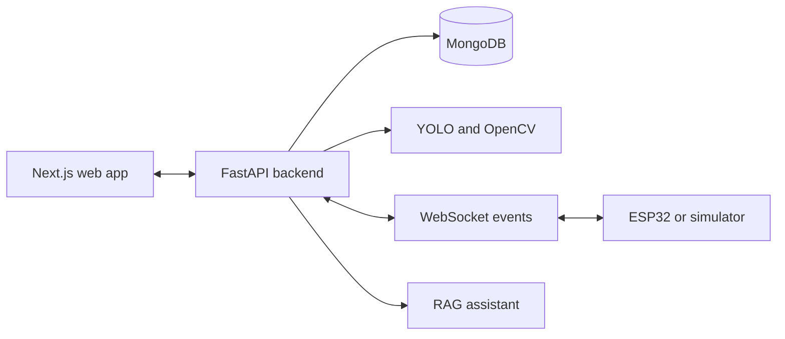

# Setorin

Setorin is a smart recycling platform that combines bottle validation, user rewards, and connected-bin control.

[Live demo](https://setorin.app)

## Overview

Setorin turns recyclable bottle drop-offs into a tracked workflow:

1. A user submits a bottle through the web application.
2. The backend validates the item with a YOLO-based model and OpenCV measurements.
3. The system records the result and updates the user's reward points.
4. The smart-bin flow can be monitored through WebSocket events and an ESP32 simulator.

The repository contains the web application, FastAPI backend, AI validation flow, database integration, and IoT simulation components.

## Features

### Bottle validation

- Bottle brand detection with a YOLO model
- Dimension and volume estimation with OpenCV
- Validation rules for bottle quality and eligibility

### Rewards

- Point calculation for validated submissions
- User balance and withdrawal flows
- Admin controls for managing points and withdrawals

### Assistant

- RAG-based Robin assistant
- Gemini model integration
- Knowledge-base material for recycling-related questions

### Dashboard

- User and transaction management
- Scan activity and system monitoring
- Usage and reward analytics

### Connected-bin flow

- WebSocket communication between services
- ESP32 control integration
- Local simulator for development without physical hardware

## Architecture



The frontend handles user and admin flows. The backend owns authentication, validation, rewards, persistence, and real-time communication. The IoT simulator provides a local stand-in for the connected bin.

## Technology

| Area | Tools |
| --- | --- |
| Frontend | Next.js, React, Tailwind CSS |
| Backend | FastAPI, Pydantic |
| AI and computer vision | YOLO, Roboflow, OpenCV |
| Data | MongoDB, Motor |
| Assistant | RAG, LangChain, Gemini |
| Real-time and hardware | WebSocket, ESP32 |
| Development | Docker Compose, Pytest, ESLint, Ruff |

## Repository layout

```text
.
|-- app/                 # Next.js frontend and API-facing UI
|-- backend/             # FastAPI application and backend tests
|-- iot_simulator/       # Local WebSocket simulator for the smart bin
|-- prisma/              # Database-related project files
|-- public/              # Frontend assets
|-- testing/             # Test and integration material
|-- docs/                # Supporting project documentation
|-- docker-compose.yml   # Local multi-service environment
+-- Dockerfile.frontend  # Frontend container configuration
```

## Getting started

### Prerequisites

- Docker and Docker Compose
- Git
- A Roboflow API key for bottle validation
- Google OAuth credentials if authentication is enabled locally

### Run with Docker Compose

```bash
git clone https://github.com/pablonification/Setorin-AICCompfest2025.git
cd Setorin-AICCompfest2025
docker compose up --build
```

Configure the required frontend and backend environment variables for your local deployment before starting the services. Keep credentials in local environment files and never commit them.

The default service ports are:

| Service | Port |
| --- | --- |
| Frontend | 3000 |
| Backend | 8000 |
| MongoDB | 27017 |
| Redis | 6379 |
| IoT simulator | 8080 |

### Run services manually

Frontend:

```bash
npm install
npm run dev
```

Backend and API details are documented in [backend/README.md](backend/README.md).

To start the IoT simulator:

```bash
cd iot_simulator
python websocket_server.py
```

## Configuration

The application uses separate frontend and backend configuration for:

- MongoDB connection and database settings
- Roboflow model access
- JWT and Google OAuth authentication
- Frontend API URL
- IoT WebSocket URL
- Reward and withdrawal thresholds

Use placeholder values locally and keep production credentials outside the repository.

## Development checks

Common checks include:

```bash
npm run lint
pytest
```

Run the checks relevant to the service you change before opening a pull request.

## Documentation

- [Backend setup and API notes](backend/README.md)
- [RAG knowledge base](docs/AI_RAG_KB.md)
- [Point system](docs/Point_System.md)
- [ESP32 integration](docs/ESP32_SmartBin_Integration.md)
- [Smart-bin design](docs/ESP32_SmartBin_Design.md)

## Current scope

- Bottle validation depends on the configured Roboflow model and API access.
- Hardware behavior can be exercised locally through the IoT simulator.
- Google OAuth and reward withdrawals require the corresponding service configuration.
- The deployed application may expose only the features enabled in its production environment.
